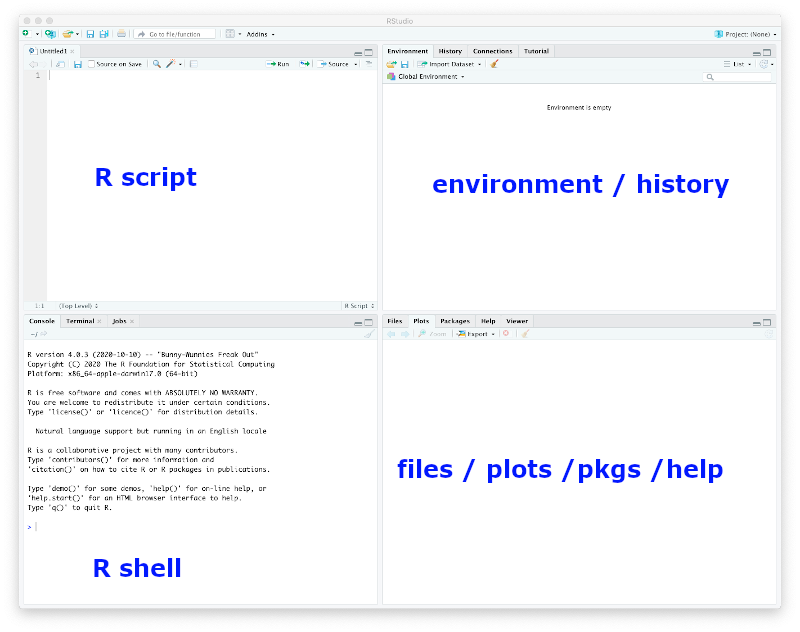

# Objectives

The learning objectives for this practical are:

  * Writing R scripts

# Setup and background

To do this practical you need an installation of R and RStudio. You can find
the instructions in the [setup](/setup/) link on how to install R and RStudio
in your system. For a smooth development of this practical, it is strongly
recommended that you follow and finish the previous [practical 8](/practical 8/).

We will download some COVID19 data to illustrate the use of R and RStudio.
Please follow the next two steps:

1. Go to the Catalan Health Departament COVID19 data portal at
   [https://dadescovid.cat](https://dadescovid.cat) and switch the language to
   "ENGLISH" using the pull-down menu on the top-right corner of the page.
2. Follow the downloads link and on the next page click and download the file
   corresponding to the "7 DAY AGGREGATION" for "CATALUNYA".
   Make sure you know exactly where in your filesystem this file
   has been downloaded. **Tip:** some browsers automatically download files
   into a folder called "Downloads" or under a name corresponding to the
   translation of "Downloads" to the default language of your operating system.
3. Make a directory in your filesystem, for instance at your _home_ directory,
   called `practical 8` and copy in it the downloaded file.
4. Since the downloaded file is a ZIP file, uncompress as you did in
   [practical 1](/practical1/) so that you finally have a file called
   `catalunya_setmanal.csv` in the directory `practical8`.

If you are using the UPF _myapps_ cloud to run RStudio, then you need to
either use an internet browser in _myapps_ to download the data file directly
in the _myapps_ cloud or upload to the _myapps_ cloud the file that you have
downloaded in your own computer.

# Writing R scripts

We may often use an interactive R session to quickly examine data or make some
straightforward calculations. In such an interactive session, we can also recover
previous instructions in the R shell by pressing the `upwards arrow` key. However,
if we really want to keep track of the R commands we are using, we should write
them in a text file with filename extension `.R`, which we shall refer hereafter
as an _R script_. 

There are two main ways to create an R script: (1) openining a new file with a
text editor and saving it with filename that includes the `.R` extension, or (2)
if we are working with RStudio, then we click on the `File` menu and select
the options `New File` -> `R Script`. When we do that we should be getting the
RStudio window splitted in four panes, the default three ones and one additional
one for the newly created R script, as shown in the captured window below.

