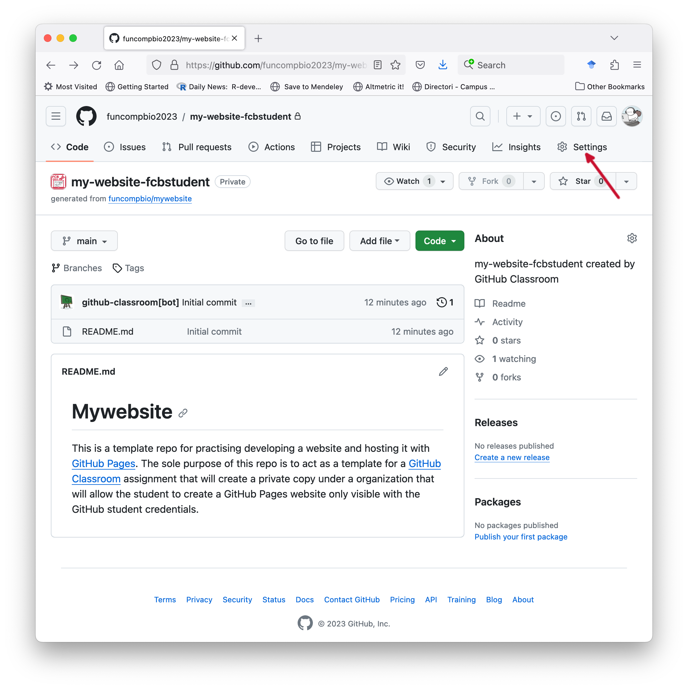
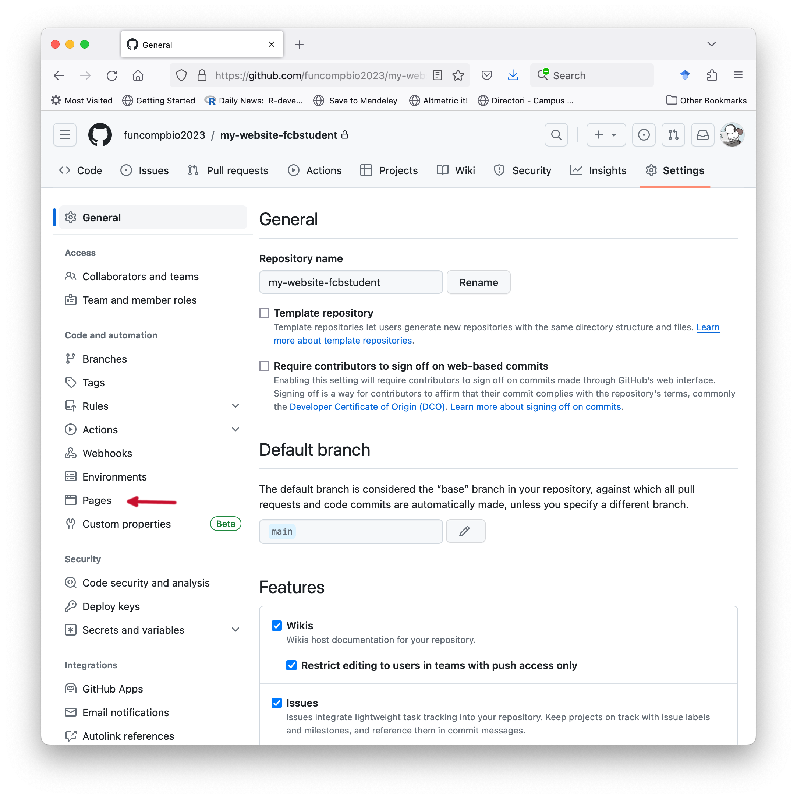
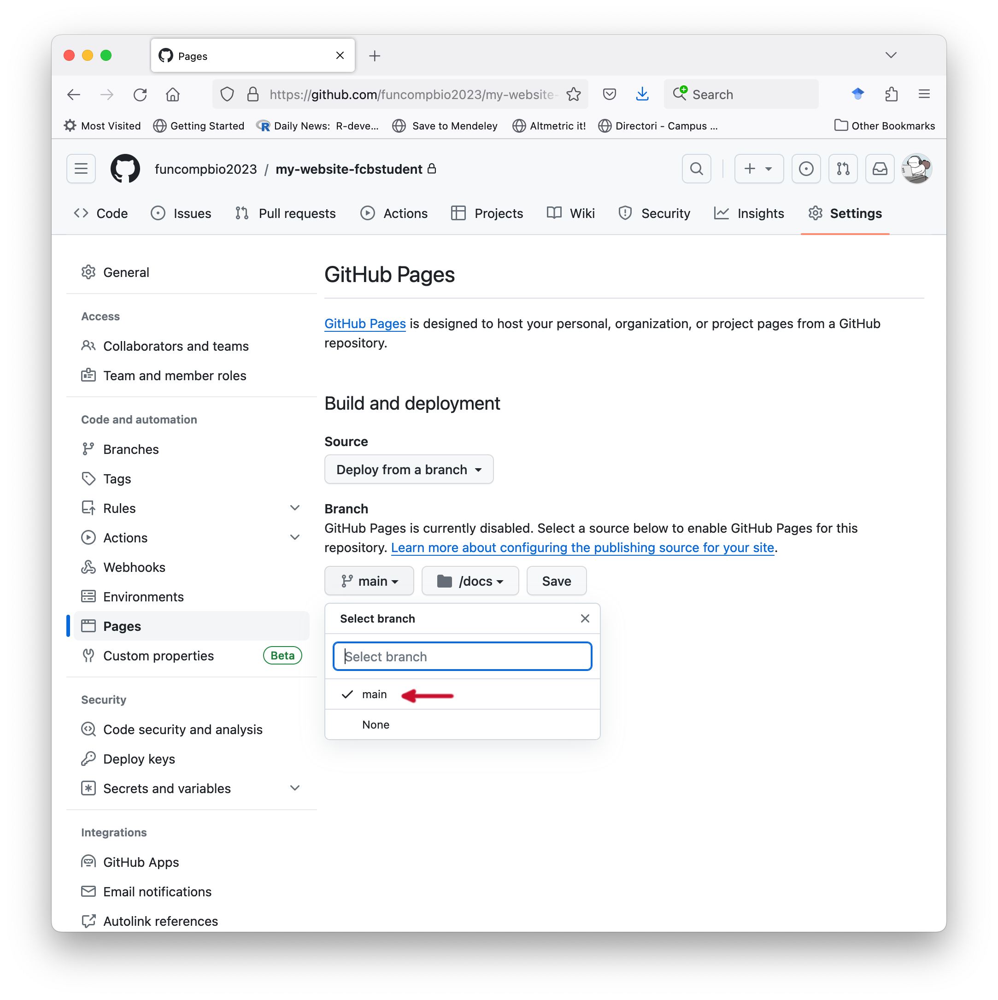
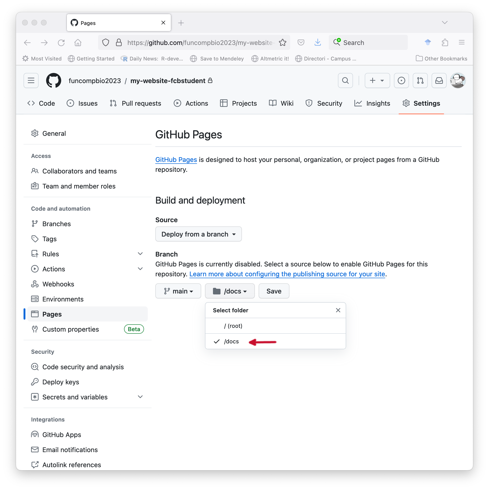

# Objectives

The learning objectives for this practical are:

  * Create HTML documents.
  * Publish your website with GitHub Pages.
  * Create Markdown documents.

# Setup and background

To do this practical you only need text editor an a web browser. Make a new directory called
`practical9` and store there the files generated during this practical.

# HTML documents

The basic skeleton for an HTML document consists of:

1. A [DOCTYPE](https://www.w3schools.com/tags/ref_html_dtd.asp) element
that tells the web browser this is an HTML document:

    ```
    <!DOCTYPE html>
    ```

2. A [head](https://www.w3schools.com/tags/tag_head.asp) element, which contains
metadata, enclosed in other HTML elements, about the whole document
such as a title that is displayed in the browser tab displaying the HTML document.
Another common metadata to be included here is the one associated with the `<style>` element.

    ```
    <head>
      <title>Page Title</title>
    </head>
    ```

3. A [body](https://www.w3schools.com/tags/tag_body.asp) element with the main content
of the HTML document, which in this case consists of a heading and a paragraph.

    ```
    <body>
      <h1>This is a first-level heading</h1>

      <p>This is a paragraph.</p>
    </body>
    ```

The elements in parts 2 and 3 of the skeleton are enclosed by starting `<html>` and ending
`</html>` elements. The whole skeleton together looks as follows:

```html
<!DOCTYPE html>
<html>
<head>
  <title>Page Title</title>
</head>
<body>
  <h1>This is a first-level heading</h1>

  <p>This is a paragraph.</p>
</body>
</html>
```

Using a text editor, copy and paste the previous code into a text file called `index.html`,
and open it with the web browser (`File -> Open File ...`).

The basic HTML elements are:

* A text [headings](https://www.w3schools.com/tags/tag_hn.asp): `<h1>`, `<h2>`, ..., `<h5>`, `<h6>`.

* A [paragraph](https://www.w3schools.com/tags/tag_p.asp): `<p>`.

* An [unordered (bulleted) list](https://www.w3schools.com/tags/tag_ul.asp): `<ul>` and `<li>`.

* An [ordered list](https://www.w3schools.com/tags/tag_ol.asp): `<ol>` and `<li>`.

* A [hyperlink](https://www.w3schools.com/tags/tag_a.asp): `<a>` with the `href` attribute specifying the linked file or URL.

* An [image](https://www.w3schools.com/tags/tag_img.asp): `` with the `src` attribute specifying the path to the image file.

* A [single line break](https://www.w3schools.com/tags/tag_br.asp): `<br>`.

* An [horizontal ruler](https://www.w3schools.com/tags/tag_hr.asp): `<hr>`.

**Exercise:** Using some of these elements, edit the file `index.html` and modify it to
make a web page about your favorite (or unbeloved) music band. The page should
include two sections, one with the origins of the band and its members, and
another with its discography (shorten it to the most relevant one if it is too long).
Add a picture of the band and a link to their official web page (if they don't have one,
then link to some other website that talks about them). Try to keep it under 30 lines.
To display in the web browser the changes you make you need to (1) save the file in
your text editor and (2) press the reload button in the tab from web browser
where you loaded the page.

## Styling with CSS

You can alter the _style_ of HTML elements using so-called
[CSS](https://en.wikipedia.org/wiki/CSS) declarations. There are different ways
to include them, one of them is through the `<style>` element in the `<head>`
section of the HTML document. For instance, edit your `index.html` file
and add the following CSS declaration within the `<head>` section:

```
<style>
h1 {
  font-family: arial;
}
</style>
```
Now reload the page and you should see how the text associated with the first-level
heading `<h1>` elements has changed its font. Consult the following
[link](https://www.w3schools.com/css/default.asp) and change in the file
`index.html` the default black color of the first-level heading `<h1>` element
into another one.

# Publish your website with GitHub Pages

GitHub offers a free [web hosting service](https://en.wikipedia.org/wiki/Web_hosting_service)
called [GitHub Pages](https://pages.github.com) with some
[restrictions and usage limits](https://docs.github.com/en/pages/getting-started-with-github-pages/about-github-pages#limits-on-use-of-github-pages)
such as a maximum disk usage of 1 Gb. While those limits may be too tight for
websites with high-resolution images and videos, they are large enough for text
content with low resolution images and graphics, such as those produced in the
context of data analysis projects.

Here we are going to learn how to publish a website with GitHub pages, but using
a private repo created through an assignment from
[GitHub Classroom](https://classroom.github.com), which will make the website only
visible after logging into GitHub with our credentials. Please follow these three
steps to create the GitHub repo that we will use to publish your website:

1. Log into your GitHub account.
2. Go to the Moodle site of FCB and click on the link called
   _Website assignment_ and accept the assignment. This will create a private
   repo with an URL of the form `https://github.com/funcompbio2023/my-website-xxxx`
   where `xxxx` is your GitHub username.
3. Clone this GitHub repo on your local disk. This step will create a directory
   called `my-website-xxxx` where `xxxx` is your GitHub username. Enter in this
   directory with the Unix `cd` command.

Now let's put the website content in the right place of our repo, as follows:

1. **Within** the directory of your `my-website-xxxx` repo, create another
   directory called `docs`.
2. Copy in this directory called `docs` the file `index.html` you created before
   and any associated image files.
3. From the root of your `my-website-xxxx` repo, stage, commit and push these
   changes to the remote GiHub repo.

GitHub will look up the contents of your website from a so-called
[publishing source](https://docs.github.com/en/pages/getting-started-with-github-pages/about-github-pages#publishing-sources-for-github-pages-sites) which can be either the root of your repo or a
directory called `docs` in any branch including the default `main` branch. In
certain settings, the publishing source is the root of a branch called `gh-pages`.
In this practical, we will set as publishing source the `docs` directory of the
main branch as follows.

1. Click on the `Settings` tab of your repo.

    

2. Click on the `Pages` menu option on the left panel under _Code and automation_.

    

3. In the section **Build and deployment**, under the subsection **Branch**,
   click on the pull-down menu that by default says `None` and select the
   `main` branch.

    

4. Click on the pull-down menu that says `/(root)` and select `/docs`, then
   click on the `Save` button.

    

5. The GitHub Pages settings panel will refresh automatically and at the top
   you should see the message `GitHub Pages source saved. If you refresh the
   page through the reload button of the browser you should see a new message
   at the top that says `Your site is live at` followed by an URL. That's
   the URL of your website, open it up in a new tab of your web browser.

    

If there is any error in the website code, or the publishing source (branch
and directory) is wrongly specified or not filled with content, GitHub will
not show you the URL.

Each time that you push changes in the `docs` directory to the remote GitHub
repo, GitHub will have to _rebuild_ and _publish_ your website, which may take 
a few minutes. You can see how GitHub is building your webiste by going to the
the page of your GitHub repo at `https://github.com/funcompbio2023/my-website-xxxx`
and clicking on the orange dot and then in the `Details` links from the pop-up
menu.

  

When that build is finished, you have to go to your website URL and press the
reload button in your browser to see your website updated.

GitHub Pages offers the possibility to have an URL associated with your GitHub account
`https://xxxx.github.io`, where `xxxx` is your GitHub username and have a public website
published under that URL. The steps to build that website are essentially the same as
the previous ones with the addition that the repo hosting the publishing source of the
website should be public and called `xxxx.github.io`. A very well paced guide to create
such a public website with GitHub Pages is the one by
[Jonathan McGlone](http://jmcglone.com/guides/github-pages) and the
[GitHub Learning Lab](https://github.com/apps/github-learning-lab) has also
very good interative
[course](https://github.com/skills/github-pages). Another
even easier option to publish HTML files under a public URL is
[Netlify Drop](https://app.netlify.com/drop), which can be handy if you need to quickly
share a website.

# Markdown

We will learn Markdown as follows. In one tab of your browser open the
[CommonMark reference page](https://commonmark.org/help). In another tab
follow the 10-minute [CommonMark tutorial](https://commonmark.org/help/tutorial).

Once you are finished with the tutorial, create a Markdown version of your previous
file `index.html`, i.e., a `index.md` file, with all the previous content
but formatted using Markdown only. Store that `index.md` file in the `docs`
directory of the GitHub repo you created in the previous section. Rename the
file `index.html` to `old_index.html`. Stage, commit and push these changes
to the remote GitHub repo. Checkout after a few minutes that the website has
been updated.
